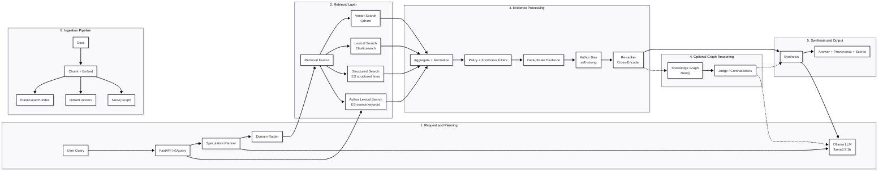

# SAG-RAG Backend

Speculative -> Agentic -> Graph RAG backend with FastAPI, Qdrant, Elasticsearch, and Neo4j.
This repo implements the full SAG-RAG pipeline and a local Docker Compose stack.

Architecture diagram



What we built
- End-to-end SAG-RAG pipeline: speculative planning, multi-agent retrieval, re-ranking, graph reasoning, judge, and synthesis with provenance.
- Local deployment: Docker Compose for the full stack.

What is special / novel
- Speculative query planning to generate targeted sub-queries before retrieval.
- Hybrid retrieval (vector + lexical + structured) with domain routing and policy controls.
- Knowledge graph enrichment with claims, contradictions, relations, and path-based evidence scoring.
- Explicit judge + synthesis stages to improve factual grounding and provenance.

Key features
- Speculative planner with fallback rules.
- Parallel vector, lexical, and structured retrieval agents.
- Cross-encoder re-ranker and deduplication.
- Author-aware biasing and gap-aware fallback messaging.
- Knowledge graph building (entities, claims, relations, contradictions).
- Graph reasoning output with evidence scores and path signals.
- Judge step with contradiction penalties and relation boosts.
- Synthesis with provenance (offsets), confidence, and explain trace.
- Feedback endpoint and audit logging.

Tools and techniques used
- FastAPI for API layer.
- Qdrant for vector search.
- Elasticsearch for BM25/lexical search.
- Neo4j for knowledge graph storage and traversal.
- SentenceTransformers for embeddings and re-ranking.
- spaCy for NER and relation extraction.
- Ollama for local LLM generation.
- Docker Compose for deployment.

Architecture (high level)
1) Client sends query to FastAPI.
2) Speculative planner emits intent and sub-queries.
3) Agent controller fans out to vector/lexical/structured retrievers.
4) Results deduped and re-ranked.
5) Graph builder enriches evidence (entities, claims, relations).
6) Graph reasoning produces evidence scores and contradiction signals.
7) Judge validates evidence and sets confidence.
8) Synthesis generates final answer with provenance.
9) Feedback and audit logs stored for analysis.

Total workflow (query path)
Request -> plan -> retrieve -> dedupe -> rerank -> graph context -> judge -> synthesis -> response.

Quickstart (local)
1) Start infra services (Qdrant/Elasticsearch/Neo4j)
2) Run the backend container or `uvicorn app.main:app --host 0.0.0.0 --port 8000`
3) Ingest docs: `POST /v1/ingest`
4) Query: `POST /v1/query`

Local env
- Copy `.env.example` to `.env` and fill in values.

Config (env vars)
- `OLLAMA_URL`, `OLLAMA_MODEL`
- `QDRANT_URL`, `ELASTIC_URL`, `NEO4J_URI`, `NEO4J_USER`, `NEO4J_PASSWORD`
- `RETRIEVER_TIMEOUT_S` (per-retriever timeout in seconds; default: 12)
- `GRAPH_ENABLED` (true/false)
- `DOMAIN_KEYWORDS` (JSON dict of domain -> keyword list)
- `DOMAIN_MIN_KEYWORD_HITS` (default: 2)
- `DOMAIN_ALIASES` (JSON dict of domain -> alias list)
- `AUTHOR_BIAS` (implicit; author terms detected from query + domain keywords)
- `QUERY_TERM_SYNONYMS` (JSON dict, e.g. {"fear":["dread","anxiety","timor"]})
- `AUTHOR_INDEX_PATH` (path for author→source index written at ingest)
- `POLICY_BLOCKLIST`, `POLICY_ALLOWLIST`
- `POLICY_SOURCE_TYPES_ALLOW`, `POLICY_SOURCE_TYPES_BLOCK`
- `POLICY_DOMAINS_ALLOW`, `POLICY_DOMAINS_BLOCK`
- `POLICY_RULES` (JSON list of rule objects with `action`, `domains`, `source_types`, `contains`, `not_contains`)
- `TENANT_ISOLATION` (true/false)
- `LLM_MAX_CONCURRENT` (limits concurrent LLM calls)

Domain routing example
```
DOMAIN_KEYWORDS='{"stoicism":["stoic","seneca","epictetus","marcus"],"finance":["earnings","revenue","sec"]}'
DOMAIN_MIN_KEYWORD_HITS=2
```

Author queries & fallback
- If the query names an author (e.g., "Seneca"), results are biased toward that author.
- Keyword expansion is applied (e.g., "fear" -> fear/dread/terror/anxiety/timor/metus).
- If no author passages mention the query keywords, the response includes an explicit note and falls back to other sources (non-author results are shown).
- Ingest builds a lightweight author→source index to speed author filtering.

Example synonym config
```
QUERY_TERM_SYNONYMS={"fear":["dread","terror","anxiety","timor","metus"]}
```

Failure analysis (current)
- Retrieval failure tags: `no_domain`, `policy_blocked`, `vector_timeout|vector_zero_hits|vector_error`, `lexical_timeout|lexical_zero_hits|lexical_error`, `structured_timeout|structured_zero_hits|structured_error`, `lexical_author_timeout|lexical_author_zero_hits|lexical_author_error` (author queries), `cross_domain_conflict`, `no_results`, `author_gap`, `synthesis_timeout|synthesis_error`, `low_result_count`, `low_top_score`.
- Hallucination risk metric exposed in `/metrics`.
- Evidence coverage ratio metric exposed in `/metrics`.
- Synthesis observability in `/metrics`:
  - `sag_rag_synthesis_total{outcome=...}`
  - `sag_rag_synthesis_latency_ms_bucket{outcome=...,le=...}` (use for p95)

Ablation helper
- Use `tools/ablation_eval.py` with multiple base URLs (different env configs) to compare outputs.
Example:
```
python tools/ablation_eval.py \
  --base-urls http://localhost:8000,http://localhost:8001 \
  --queries data/ablation_queries.txt \
  --output ablation_results.jsonl
```

Deployment
- Docker Compose: `infra/docker-compose.yml`

Admin UI
- `GET /ui` (simple dashboard for recent queries and feedback)

Notes on completeness
This repo is a production-ready MVP with full pipeline wiring and scaffolding.
Advanced training (LoRA), full GNN reasoning, and large-scale evaluation are left as research extensions.

Comparison (SAG-RAG vs other RAG approaches)

| Technique | Strengths | Limitations | How SAG-RAG improves |
|---|---|---|---|
| Naive RAG (single retriever, no planning) | Simple, fast to build | Irrelevant context, weaker grounding | Speculative planner + multi-agent retrieval reduce noise |
| Vector-only RAG | Captures semantic similarity | Misses exact matches, brittle for numbers | Adds lexical + structured retrievers and re-ranking |
| BM25-only RAG | Good exact match recall | Poor semantic coverage | Adds embeddings + planner to target needs |
| Hybrid RAG (vector + BM25) | Better recall than single method | Still noisy; limited reasoning | Adds graph reasoning, judge, and provenance |
| Rerank-only pipelines | Higher relevance | Still lacks reasoning/verification | Adds explicit judge and contradiction handling |
| Graph-RAG (basic entity graph) | Improved explainability | Shallow reasoning | Adds claims, contradictions, relation paths, and evidence scoring |
| Toolformer-style agentic RAG | Flexible tool use | Hard to audit; noisy | Explicit planning + retrieval envelopes + audit logs |
