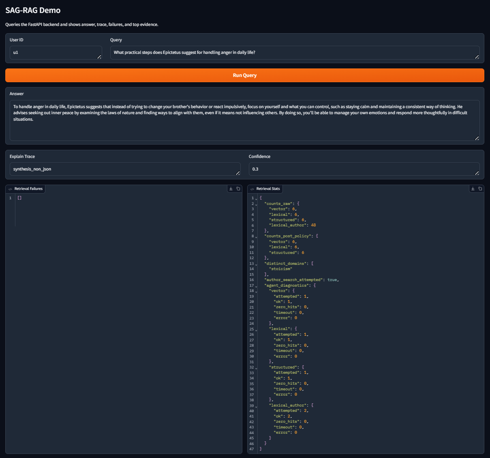
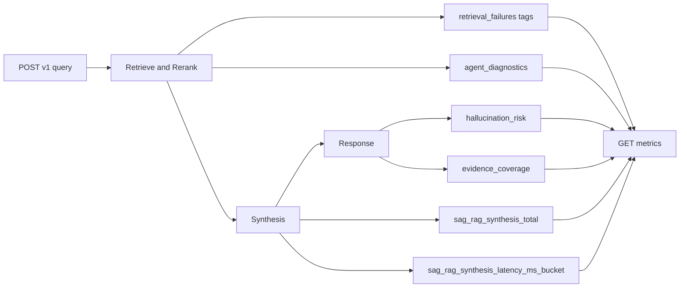

# SAG-RAG Backend

Speculative -> Agentic -> Graph RAG backend with FastAPI, Qdrant, Elasticsearch, and Neo4j.
This repo implements the full SAG-RAG pipeline and a local Docker Compose stack.

**Docs:** component + data-flow reference in [`docs/architecture.md`](docs/architecture.md).
When the backend is running, the live API schema is at **`/docs`** (Swagger UI)
and **`/redoc`**.

Architecture diagram


```mermaid
---
config:
  look: neo
  theme: redux
---
flowchart LR

  subgraph A[1. Request and Planning]
    direction TB
    U[User Query]
    API[FastAPI /v1/query]
    PLAN[Speculative Planner]
    ROUTE[Domain Router]
    LLM[Ollama LLM\nllama3.2:1b]
    U --> API
    API --> PLAN
    PLAN --> ROUTE
    PLAN --> LLM
  end

  subgraph B[2. Retrieval Layer]
    direction TB
    RETR[Retrieval Fanout]
    VEC[Vector Search\nQdrant]
    LEX[Lexical Search\nElasticsearch]
    STR[Structured Search\nES structured lines]
    AUTH[Author Lexical Search\nConditional ES source keyword]
    RETR --> VEC
    RETR --> LEX
    RETR --> STR
  end

  subgraph C[3. Evidence Processing]
    direction TB
    AGG[Aggregate + Normalize]
    POL[Policy + Freshness Filters]
    DEDUP[Deduplicate Evidence]
    BIAS[Author Bias\nsoft-strong]
    RR[Re-ranker\nCross-Encoder]
    AGG --> POL --> DEDUP --> BIAS --> RR
  end

  subgraph D[4. Optional Graph Reasoning]
    direction TB
    G[Knowledge Graph\nNeo4j]
    J[Judge / Contradictions]
    G --> J
  end

  subgraph E[5. Synthesis and Output]
    direction TB
    SYN[Synthesis and Fallback\nnon_json timeout error]
    OUT[Answer + Provenance + Scores]
    SYN --> OUT
  end

  subgraph F[6. Telemetry]
    direction TB
    OBS[Metrics + Diagnostics]
    RF[retrieval_failures]
    AD[agent_diagnostics]
    SM[synthesis outcomes + latency]
    OBS --> RF
    OBS --> AD
    OBS --> SM
  end

  subgraph G[7. Ingestion Pipeline]
    direction TB
    DOCS[Docs]
    CHUNK[Chunk + Embed]
    ES[Elasticsearch Index]
    QDR[Qdrant Vectors]
    NEO[Neo4j Graph]
    DOCS --> CHUNK
    CHUNK --> ES
    CHUNK --> QDR
    CHUNK --> NEO
  end

  ROUTE --> RETR
  API -. explicit author terms .-> AUTH
  VEC --> AGG
  LEX --> AGG
  STR --> AGG
  AUTH --> AGG
  RR --> SYN
  SYN --> LLM
  RR -.-> G
  J -.-> SYN
  J -.-> LLM
  OUT --> OBS
```

<p align="center">
  
</p>
<p align="center"><em>Figure: SAG-RAG Gradio demo with grounded answer, trace, and retrieval diagnostics.</em></p>

What we built
- End-to-end SAG-RAG pipeline: speculative planning, multi-agent retrieval, re-ranking, graph reasoning, judge, and synthesis with provenance.
- Local deployment: Docker Compose for the full stack.

What is special / novel
- Speculative query planning to generate targeted sub-queries before retrieval.
- Hybrid retrieval (vector + lexical + structured) with domain routing and policy controls.
- Knowledge graph enrichment with claims, contradictions, relations, and path-based evidence scoring.
- Explicit judge + synthesis stages to improve factual grounding and provenance.

Key features
- Speculative planner with fallback rules.
- Parallel vector, lexical, and structured retrieval agents.
- Cross-encoder re-ranker and deduplication.
- Author-aware biasing and gap-aware fallback messaging.
- Knowledge graph building (entities, claims, relations, contradictions).
- Graph reasoning output with evidence scores and path signals.
- Judge step with contradiction penalties and relation boosts.
- Synthesis with provenance (offsets), confidence, and explain trace.
- Feedback endpoint and audit logging.

Tools and techniques used
- FastAPI for API layer.
- Qdrant for vector search.
- Elasticsearch for BM25/lexical search.
- Neo4j for knowledge graph storage and traversal.
- SentenceTransformers for embeddings and re-ranking.
- spaCy for NER and relation extraction.
- Ollama for local LLM generation.
- Docker Compose for deployment.

Architecture (high level)
1) Client sends query to FastAPI.
2) Speculative planner emits intent and sub-queries (normalized before fanout).
3) Agent controller fans out to vector/lexical/structured retrievers.
4) Author lexical retrieval runs when explicit author terms are detected.
5) Results are filtered, deduped, author-biased, and re-ranked.
6) Graph builder optionally enriches evidence (entities, claims, relations).
7) Judge validates evidence and sets confidence.
8) Synthesis returns JSON or fallback output (`non_json`, `timeout`, `error` paths).
9) Telemetry emits retrieval failures, agent diagnostics, and synthesis latency/outcomes.

Total workflow (query path)
Request -> plan -> retrieve -> dedupe -> rerank -> graph context -> judge -> synthesis -> response.

Quickstart (local)
1) Start infra services (Qdrant/Elasticsearch/Neo4j)
2) Run the backend container or `uvicorn app.main:app --host 0.0.0.0 --port 8000`
3) Ingest docs: `POST /v1/ingest`
4) Query: `POST /v1/query`
5) Optional Gradio UI: `http://localhost:7860`

Local env
- Copy `.env.example` to `.env` and fill in values.

Config (env vars)
- `OLLAMA_URL`, `OLLAMA_MODEL`
- `QDRANT_URL`, `ELASTIC_URL`, `NEO4J_URI`, `NEO4J_USER`, `NEO4J_PASSWORD`
- `RETRIEVER_TIMEOUT_S` (per-retriever timeout in seconds; default: 12)
- `CONFIDENCE_ALIGNMENT_FLOOR` (confidence floor when top evidence alignment is strong; default: 0.55)
- `CONFIDENCE_ALIGNMENT_TOP_SCORE_MIN` (minimum top rerank score for floor activation; default: -6.0)
- `GRAPH_ENABLED` (true/false)
- `DOMAIN_KEYWORDS` (JSON dict of domain -> keyword list)
- `DOMAIN_MIN_KEYWORD_HITS` (default: 2)
- `DOMAIN_ALIASES` (JSON dict of domain -> alias list)
- `AUTHOR_BIAS` (implicit; author terms detected from query + domain keywords)
- `QUERY_TERM_SYNONYMS` (JSON dict, e.g. {"fear":["dread","anxiety","timor"]})
- `AUTHOR_INDEX_PATH` (path for author→source index written at ingest)
- `POLICY_BLOCKLIST`, `POLICY_ALLOWLIST`
- `POLICY_SOURCE_TYPES_ALLOW`, `POLICY_SOURCE_TYPES_BLOCK`
- `POLICY_DOMAINS_ALLOW`, `POLICY_DOMAINS_BLOCK`
- `POLICY_RULES` (JSON list of rule objects with `action`, `domains`, `source_types`, `contains`, `not_contains`)
- `TENANT_ISOLATION` (true/false)
- `LLM_MAX_CONCURRENT` (limits concurrent LLM calls)

Domain routing example
```
DOMAIN_KEYWORDS='{"stoicism":["stoic","seneca","epictetus","marcus"],"finance":["earnings","revenue","sec"]}'
DOMAIN_MIN_KEYWORD_HITS=2
```

Author queries & fallback
- If the query names an author (e.g., "Seneca"), results are biased toward that author.
- Keyword expansion is applied (e.g., "fear" -> fear/dread/terror/anxiety/timor/metus).
- If no author passages mention the query keywords, the response includes an explicit note and falls back to other sources (non-author results are shown).
- Ingest builds a lightweight author→source index to speed author filtering.

Example synonym config
```
QUERY_TERM_SYNONYMS={"fear":["dread","terror","anxiety","timor","metus"]}
```

Failure analysis (current)
- Retrieval failure tags: `no_domain`, `policy_blocked`, `vector_timeout|vector_zero_hits|vector_error`, `lexical_timeout|lexical_zero_hits|lexical_error`, `structured_timeout|structured_zero_hits|structured_error`, `lexical_author_timeout|lexical_author_zero_hits|lexical_author_error` (author queries), `cross_domain_conflict`, `no_results`, `author_gap`, `synthesis_timeout|synthesis_error`, `low_result_count`, `low_top_score`.
- Hallucination risk metric exposed in `/metrics`.
- Evidence coverage ratio metric exposed in `/metrics`.
- Synthesis observability in `/metrics`:
  - `sag_rag_synthesis_total{outcome=...}`
  - `sag_rag_synthesis_latency_ms_bucket{outcome=...,le=...}` (use for p95)

Observability flow


```mermaid
flowchart LR
  Q[POST v1 query] --> R[Retrieve and Rerank]
  R --> S[Synthesis]
  S --> O[Response]

  R --> RF[retrieval_failures tags]
  R --> AD[agent_diagnostics]
  O --> HR[hallucination_risk]
  O --> EC[evidence_coverage]
  S --> SO[sag_rag_synthesis_total]
  S --> SL[sag_rag_synthesis_latency_ms_bucket]
  RF --> M[GET metrics]
  AD --> M
  HR --> M
  EC --> M
  SO --> M
  SL --> M
```

Ablation helper
- Use `tools/ablation_eval.py` with multiple base URLs (different env configs) to compare outputs.
Example:
```
python tools/ablation_eval.py \
  --base-urls http://localhost:8000,http://localhost:8001 \
  --queries data/ablation_queries.txt \
  --output ablation_results.jsonl
```

Deployment
- Docker Compose: `infra/docker-compose.yml`
- Start backend + Gradio:
```
docker compose -f infra/docker-compose.yml up -d backend gradio
```
- Gradio calls backend via `SAG_RAG_API_BASE` (default `http://backend:8000`).

Admin UI
- `GET /ui` (simple dashboard for recent queries and feedback)

Notes on completeness
This repo is a production-ready MVP with full pipeline wiring and scaffolding.
Advanced training (LoRA), full GNN reasoning, and large-scale evaluation are left as research extensions.

Comparison (SAG-RAG vs other RAG approaches)

| Technique | Strengths | Limitations | How SAG-RAG improves |
|---|---|---|---|
| Naive RAG (single retriever, no planning) | Simple, fast to build | Irrelevant context, weaker grounding | Speculative planner + multi-agent retrieval reduce noise |
| Vector-only RAG | Captures semantic similarity | Misses exact matches, brittle for numbers | Adds lexical + structured retrievers and re-ranking |
| BM25-only RAG | Good exact match recall | Poor semantic coverage | Adds embeddings + planner to target needs |
| Hybrid RAG (vector + BM25) | Better recall than single method | Still noisy; limited reasoning | Adds graph reasoning, judge, and provenance |
| Rerank-only pipelines | Higher relevance | Still lacks reasoning/verification | Adds explicit judge and contradiction handling |
| Graph-RAG (basic entity graph) | Improved explainability | Shallow reasoning | Adds claims, contradictions, relation paths, and evidence scoring |
| Toolformer-style agentic RAG | Flexible tool use | Hard to audit; noisy | Explicit planning + retrieval envelopes + audit logs |

## Observability

The backend exposes Prometheus text metrics at `/metrics` (and `/v1/metrics`),
including request latency histograms, `sag_rag_retrieval_failures_total`,
`sag_rag_synthesis_total` + latency, `sag_rag_hallucination_risk_bucket`, and
`sag_rag_evidence_coverage_bucket`.

An opt-in observability stack (Prometheus + Grafana + OpenTelemetry collector)
ships behind a Compose profile so the core stack stays light:

```bash
cd infra
docker compose --profile observability up
```

- **Prometheus** — http://localhost:9090 (scrapes `backend:8000/metrics`).
- **Grafana** — http://localhost:3000 (anonymous viewer enabled; admin/admin).
  A provisioned "SAG-RAG Overview" dashboard renders request rate/latency,
  retrieval failures, synthesis outcomes/latency p95, and hallucination risk.
- **OTel collector** — receives OTLP traces on `4317`/`4318`. Set `OTEL_ENABLED=true`
  (and `OTEL_EXPORTER_OTLP_ENDPOINT=http://otel-collector:4317`) so the backend
  exports spans; the collector logs them (add a Jaeger/Tempo exporter to visualize).

Config lives in `infra/prometheus.yml`, `infra/otel-collector.yaml`, and
`infra/grafana/`.

## Security (API-key auth + tenants)

Auth is **opt-in** so local development works with no key. To lock the API down
for a non-localhost deployment, set in your `.env`:

```bash
AUTH_ENABLED=true
# comma-separated keys; each key's tenant defaults to the key string itself
API_KEYS=prod-key-abc,prod-key-def
# optional explicit key -> tenant map (JSON); overrides the API_KEYS default
API_KEY_MAP={"prod-key-abc":"acme","prod-key-def":"globex"}
```

When enabled, every endpoint requires an `x-api-key` header **except** `/health`
and `/metrics` (so liveness checks and Prometheus scraping keep working), plus
the OpenAPI docs (`/docs`, `/redoc`, `/openapi.json`). Missing or unknown keys
get `401`.

```bash
curl -sS -X POST http://localhost:8000/v1/query \
  -H 'x-api-key: prod-key-abc' -H 'content-type: application/json' \
  -d '{"user_id":"u1","query":"what is virtue?"}'
```

**Tenant binding.** Set `TENANT_ISOLATION=true` alongside auth so each key is
bound to its own tenant namespace. The tenant is taken from the authenticated
key and enforced **server-side** — a `tenant` field in the request body is
ignored for authenticated requests, so a caller cannot read or write another
tenant's data by spoofing it. Without auth, the body `tenant` (falling back to
`user_id`) is used as before.

**Secrets handling.** `.env` and `infra/.env` are git-ignored and must never be
committed — see `.env.example` for the shape (with placeholder values only).
Provide real keys via the environment or a secret store; for Compose, prefer
[Docker secrets](https://docs.docker.com/engine/swarm/secrets/) or an injected
env file over baking values into images.

## API reference

The full, always-current endpoint schema is served by FastAPI's built-in OpenAPI:

- **Swagger UI:** http://localhost:8000/docs
- **ReDoc:** http://localhost:8000/redoc
- **Raw schema:** http://localhost:8000/openapi.json

For a narrative walk-through of the endpoint surface, config reference, and the
failure-tag taxonomy, see [`docs/architecture.md`](docs/architecture.md).

## Evaluation

A small labeled query set lives in `data/eval/queries.jsonl`. Score a running
stack with:

```bash
python tools/eval_metrics.py --base-url http://localhost:8000 \
  --queries data/eval/queries.jsonl --k 5 --report docs/eval_report.md
```

This produces a Markdown report (`docs/eval_report.md`, git-ignored/generated)
with retrieval recall@k / hit-rate and answer-quality scores (LLM-judge
faithfulness plus a lexical-overlap baseline). See
[`data/eval/README.md`](data/eval/README.md) for the query-set schema.

## Known limitations / research extensions

- **Graph reasoning depth** — entities, claims, relations, contradictions, and
  simple path signals; no multi-hop GNN reasoning or learned traversal yet.
- **Evaluation scope** — the bundled eval set is small and single-domain
  (stoicism); scores are indicative, not benchmark-grade.
- **Single-node infra** — Qdrant / Elasticsearch / Neo4j / Redis are single-node
  via Compose. Redis is best-effort (rate limit + cache + queue degrade to
  in-process); the ingest worker is in-process (`asyncio`), not yet a separate
  distributed consumer.
- **Training** — LoRA / fine-tuning is out of scope; `learning/export` only emits
  high-rated interactions as training data.
- **Route duplication** — endpoints are mounted at both `/v1/*` and `/*` for
  compatibility; the root alias is a known, intentional redundancy.

See [`docs/architecture.md`](docs/architecture.md#known-limitations--research-extensions)
for details.
